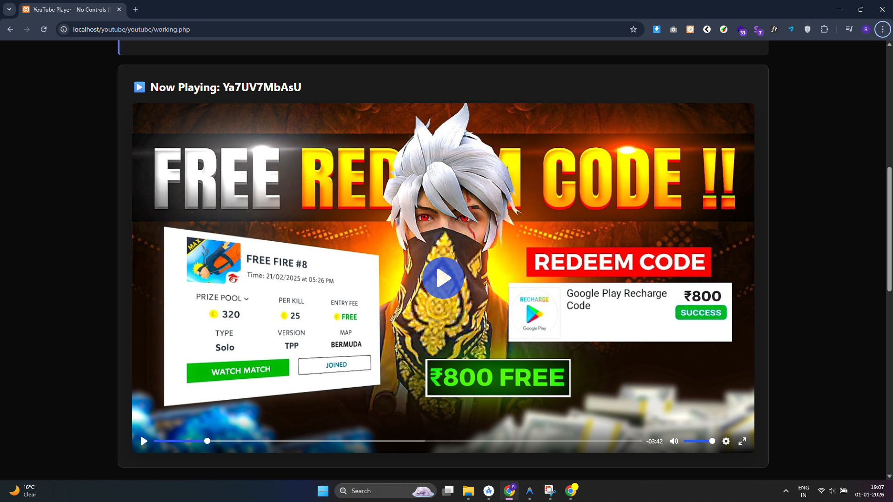
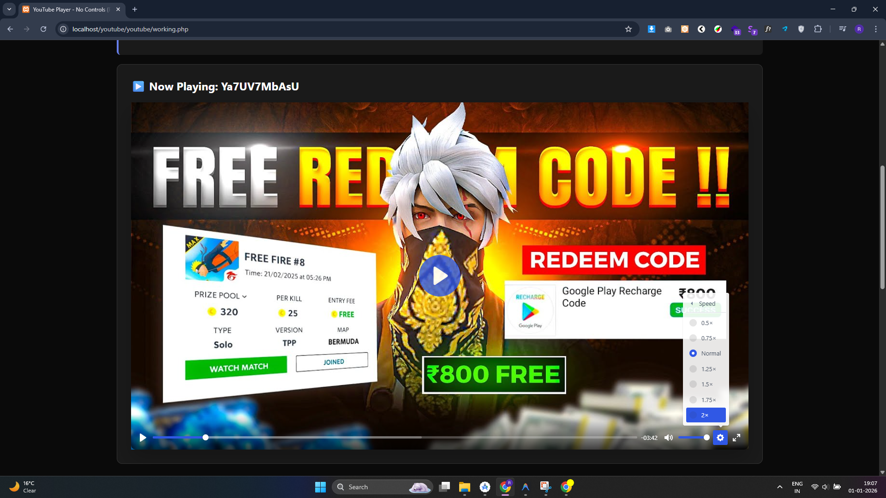
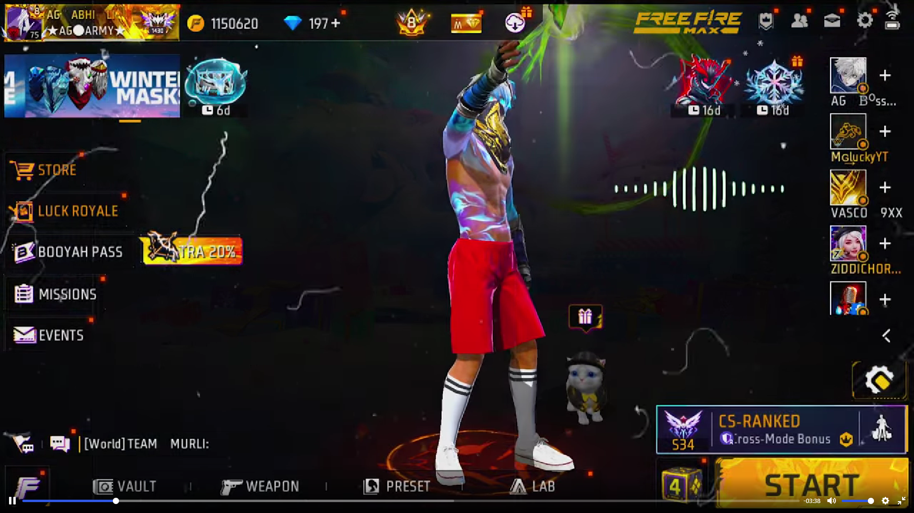
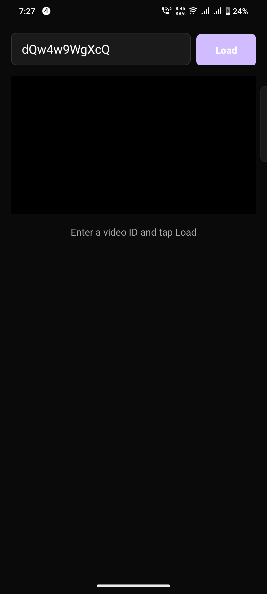

# 🎬 Android YouTube Player Library

[](https://jitpack.io/#mdakashhossain1/Android-YTPlayer)
[](LICENSE)
[](https://developer.android.com)
[](https://android-arsenal.com/api?level=21)

A professional Android YouTube player library powered by **Plyr.js**, offering complete branding removal, custom controls, and privacy-enhanced playback. Perfect for apps that need a clean, branded YouTube viewing experience.

---

## ✨ Features

| Feature | Description |
|---------|-------------|
| 🚫 **Zero Branding** | Completely removes YouTube logo, title, channel info, and related videos |
| 🎨 **Custom UI** | Beautiful Plyr.js controls with customizable colors and themes |
| 📱 **Smart Fullscreen** | Automatic landscape orientation with immersive fullscreen mode |
| 🔒 **Privacy First** | Uses `youtube-nocookie.com` for enhanced user privacy |
| ⚡ **Lightweight** | WebView-based implementation with minimal overhead |
| 🎯 **Easy Integration** | Simple API with comprehensive event listeners |
| 🌐 **Web Version** | Includes standalone HTML/JS player for web projects |

---

## 📦 Installation

### Method 1: JitPack (Recommended)

Add JitPack repository to your **`settings.gradle`** (or root `build.gradle`):

```gradle
dependencyResolutionManagement {
    repositories {
        google()
        mavenCentral()
        maven { url 'https://jitpack.io' }
    }
}
```

Add the dependency to your app's **`build.gradle`**:

```gradle
dependencies {
    implementation 'com.github.mdakashhossain1:Android-YTPlayer:v1.0.6'  // Latest version with full live stream support
    implementation 'androidx.webkit:webkit:1.12.1' // Required
}
```

### Method 2: Local Module

1. Clone or download the `youtubeplayer` module
2. Add to `settings.gradle`:
   ```gradle
   include ':youtubeplayer'
   ```
3. Add dependency in app's `build.gradle`:
   ```gradle
   implementation project(':youtubeplayer')
   ```

---

## 🚀 Quick Start

### 1. Add to Layout

```xml
<com.arknox.youtube.YouTubePlayerView
    android:id="@+id/youtubePlayerView"
    android:layout_width="match_parent"
    android:layout_height="250dp"
    android:background="#000000" />
```

### 2. Configure AndroidManifest.xml

> **⚠️ Important:** Add `android:configChanges` to prevent video reload on orientation changes

```xml
<activity
    android:name=".MainActivity"
    android:configChanges="orientation|screenSize|screenLayout|keyboardHidden"
    android:hardwareAccelerated="true">
</activity>
```

### 3. Initialize in Activity

```kotlin
class MainActivity : AppCompatActivity() {

    private lateinit var youtubePlayer: YouTubePlayerView

    override fun onCreate(savedInstanceState: Bundle?) {
        super.onCreate(savedInstanceState)
        setContentView(R.layout.activity_main)

        youtubePlayer = findViewById(R.id.youtubePlayerView)

        // Load video by ID or URL
        youtubePlayer.loadVideo("dQw4w9WgXcQ")

        // Add event listeners
        youtubePlayer.addListener(object : YouTubePlayerListener {
            override fun onReady(videoId: String) {
                Log.d("Player", "Ready: $videoId")
            }

            override fun onPlaying(videoId: String) {
                Log.d("Player", "Playing: $videoId")
            }

            override fun onPaused(videoId: String) {
                Log.d("Player", "Paused: $videoId")
            }

            override fun onEnded(videoId: String) {
                Log.d("Player", "Ended: $videoId")
            }

            override fun onFullscreenChange(isFullscreen: Boolean) {
                Log.d("Player", "Fullscreen: $isFullscreen")
            }

            override fun onError(message: String) {
                Log.e("Player", "Error: $message")
            }
        })
    }

    // Handle back button in fullscreen
    override fun onBackPressed() {
        if (youtubePlayer.isInFullscreen()) {
            youtubePlayer.exitFullscreen()
        } else {
            super.onBackPressed()
        }
    }

    // Lifecycle management
    override fun onPause() {
        super.onPause()
        youtubePlayer.pause()
    }

    override fun onDestroy() {
        youtubePlayer.release()
        super.onDestroy()
    }
}
```

---

## 📖 API Reference

### YouTubePlayerView Methods

| Method | Description |
|--------|-------------|
| `loadVideo(videoIdOrUrl: String)` | Load a YouTube video by ID or full URL |
| `play()` | Start video playback |
| `pause()` | Pause video playback |
| `toggleFullscreen()` | Toggle fullscreen mode |
| `exitFullscreen(): Boolean` | Exit fullscreen (returns true if was fullscreen) |
| `isInFullscreen(): Boolean` | Check if currently in fullscreen |
| `addListener(listener)` | Add event listener |
| `removeListener(listener)` | Remove event listener |
| `release()` | Clean up resources (call in `onDestroy()`) |

### YouTubePlayerListener Events

```kotlin
interface YouTubePlayerListener {
    fun onReady(videoId: String)              // Player initialized
    fun onPlaying(videoId: String)            // Video started playing
    fun onPaused(videoId: String)             // Video paused
    fun onEnded(videoId: String)              // Video ended
    fun onFullscreenChange(isFullscreen: Boolean) // Fullscreen toggled
    fun onError(message: String)              // Error occurred
}
```

---

## 🌐 Web Library

The repository includes a standalone **web version** for HTML/PHP/JavaScript projects.

### Installation

Copy these files from `web-lib/` to your project:
- `plyr.js` & `plyr.css` - Core Plyr library
- `script.js` & `style.css` - Custom player logic
- `plyr.svg` - Player icons

### Usage

```html
<!DOCTYPE html>
<html>
<head>
    <link rel="stylesheet" href="plyr.css">
    <link rel="stylesheet" href="style.css">
</head>
<body>
    <div class="player-wrapper">
        <div id="player" data-plyr-provider="youtube" data-plyr-embed-id="dQw4w9WgXcQ"></div>
    </div>

    <script src="plyr.js"></script>
    <script src="script.js"></script>
</body>
</html>
```

### JavaScript API

```javascript
// Load different video
loadVideo('VIDEO_ID');

// Customize player color
changePlayerColor('#ff6b6b');

// Access Plyr instance
player.play();
player.pause();
player.volume = 0.5;
player.currentTime = 30;
```

---

## 📸 Screenshots

<div align="center">

| Main Screen | Video Loaded | Fullscreen |
|-------------|--------------|------------|
|  |  |  |

| Controls | Settings | Player UI |
|----------|----------|-----------|
|  |  |  |

</div>

---

## 🔧 Technical Details

### How It Works

1. **WebView + Plyr.js**: Uses Android WebView to load a custom HTML page with Plyr.js
2. **Asset Loader**: Serves local assets via `https://appassets.androidplatform.net` for YouTube API compatibility
3. **JavaScript Bridge**: Bidirectional communication between Kotlin and JavaScript
4. **Custom Chrome Client**: Handles fullscreen events and orientation changes
5. **Privacy Mode**: All requests go through `youtube-nocookie.com`

### Plyr.js Configuration

The player uses **Presto Player "YouTube Optimized"** preset:

- `controls: 0` - Hides all YouTube native controls
- `modestbranding: 1` - Removes YouTube logo
- `rel: 0` - No related videos
- `showinfo: 0` - Hides video title
- `iv_load_policy: 3` - Hides annotations
- `noCookie: true` - Privacy-enhanced mode

---

## 🔧 Troubleshooting

### Problem: Video Fails to Load with Error "An error occurred. Please try again later"

**Symptoms:**
- Error message: "An error occurred. Please try again later (Playback ID: -0y...)"
- Toast: "Error playing video: Player error occurred"
- Works intermittently - sometimes requires app restart

**Root Causes:**
1. Temporary network connectivity issue
2. YouTube server temporarily unavailable
3. WebView cache corruption
4. Video unavailable (private, deleted, region-blocked)

**Solutions (in order):**

✅ **Automatic (Built-in v1.0.6+):**
- Library automatically retries up to 3 times (2-second delays)
- WebView cache clears on first error
- User sees "Retrying video load... (Attempt 1/3)" message

✅ **Manual:**
1. Go back to video list and try again
2. Check YouTube video is accessible (not private/deleted)
3. Clear app cache: Settings → Apps → Your App → Storage → Clear Cache
4. Check internet connection
5. Reinstall app if issue persists

---

### Problem: Live Stream Videos Not Playing

**Symptoms:**
- Live videos show player but don't load
- Error similar to regular video loading failure
- Works for regular YouTube videos

**Solution:**

Ensure you're using **v1.0.6 or later**:

```gradle
dependencies {
    implementation 'com.github.mdakashhossain1:Android-YTPlayer:v1.0.6'
    // NOT v1.0.4 or v1.0.5
}
```

**What changed:**
- v1.0.4-1.0.5: Basic live stream support (unreliable)
- **v1.0.6+**: Full live stream support with automatic retries ✅

**After updating:**
1. `./gradlew clean build`
2. Uninstall old app version
3. Reinstall app
4. Try playing live stream again

---

### Problem: Video Player Aspect Ratio Issues

**Symptoms:**
- Video is cut off on sides
- Video appears stretched
- Fullscreen looks distorted

**Solution:**

As of v1.0.5+, player height is set to `wrap_content`:

```xml
<com.arknox.youtube.YouTubePlayerView
    android:id="@+id/youtubePlayerView"
    android:layout_width="match_parent"
    android:layout_height="wrap_content"  <!-- Let library calculate -->
    android:background="#000000" />
```

The library automatically:
- Maintains 16:9 aspect ratio
- Prevents stretching
- Works in portrait AND landscape
- No special configuration needed

---

### Problem: Gradle Dependency Resolution Fails

**Error:** "Could not find com.github.mdakashhossain1:Android-YTPlayer..."

**Solution:**

Ensure JitPack repository is in `settings.gradle`:

```gradle
dependencyResolutionManagement {
    repositoriesMode.set(RepositoriesMode.FAIL_ON_PROJECT_REPOS)
    repositories {
        google()
        mavenCentral()
        maven { url = 'https://jitpack.io' }  // ✅ MUST BE PRESENT
    }
}
```

Then:
```bash
./gradlew clean
./gradlew build
```

---

### Problem: Video Reloads on Orientation Change

**Symptoms:**
- Video restarts when rotating device
- Watch time resets

**Solution:**

Add `android:configChanges` to your Activity in **AndroidManifest.xml**:

```xml
<activity
    android:name=".VideoPlayerActivity"
    android:configChanges="orientation|screenSize|screenLayout|keyboardHidden"
    android:hardwareAccelerated="true">
</activity>
```

This prevents Android from destroying/recreating the activity on orientation changes.

---

### Problem: WebView Crashes or Freezes

**Symptoms:**
- App crashes when opening player
- Player freezes after loading
- "WebView Process Crashed" errors

**Solution:**

Update WebKit dependency in `build.gradle`:

```gradle
dependencies {
    implementation 'androidx.webkit:webkit:1.12.1'  // Latest version
    implementation 'androidx.appcompat:appcompat:1.7.0'  // Latest version
}
```

Then:
```bash
./gradlew clean build
```

---

## Version Comparison

| Version | Live Streams | Retry Logic | Cache Clearing | Aspect Ratio | Status |
|---------|--------------|-------------|----------------|--------------|---------|
| 1.0.4 | ❌ | ❌ | ❌ | Fixed | Deprecated |
| 1.0.5 | ⚠️ (Buggy) | ❌ | ❌ | Fixed | Deprecated |
| **1.0.6+** | ✅ | ✅ | ✅ | wrap_content | **Latest** ✅ |

**Recommendation:** Always use **v1.0.6 or higher**

---

## 🤝 Contributing

Contributions are welcome! Please feel free to submit a Pull Request.

1. Fork the repository
2. Create your feature branch (`git checkout -b feature/AmazingFeature`)
3. Commit your changes (`git commit -m 'Add some AmazingFeature'`)
4. Push to the branch (`git push origin feature/AmazingFeature`)
5. Open a Pull Request

---

## 📄 License

This project is licensed under the **MIT License** - see the [LICENSE](LICENSE) file for details.

```
MIT License

Copyright (c) 2026 Arknox Technology

Permission is hereby granted, free of charge, to any person obtaining a copy
of this software and associated documentation files (the "Software"), to deal
in the Software without restriction, including without limitation the rights
to use, copy, modify, merge, publish, distribute, sublicense, and/or sell
copies of the Software, and to permit persons to whom the Software is
furnished to do so, subject to the following conditions:

The above copyright notice and this permission notice shall be included in all
copies or substantial portions of the Software.
```

---

## 🙏 Acknowledgments

- [Plyr.js](https://plyr.io/) - Beautiful HTML5 video player
- [JitPack](https://jitpack.io/) - Easy Android library distribution
- [YouTube IFrame API](https://developers.google.com/youtube/iframe_api_reference) - Video playback

---

## 📞 Support

- **Issues**: [GitHub Issues](https://github.com/mdakashhossain1/Android-YTPlayer/issues)
- **Email**: hossainakash22958@gmail.com
- **Website**: [arknox.in](https://arknox.in)

---

<div align="center">

**Made with ❤️ by Arknox Technology**

⭐ Star this repo if you find it useful!

</div>
